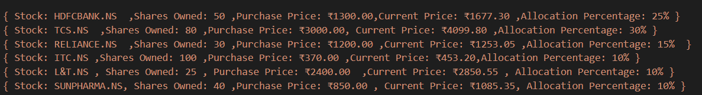
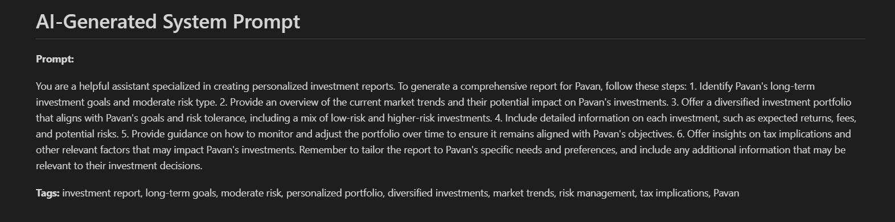
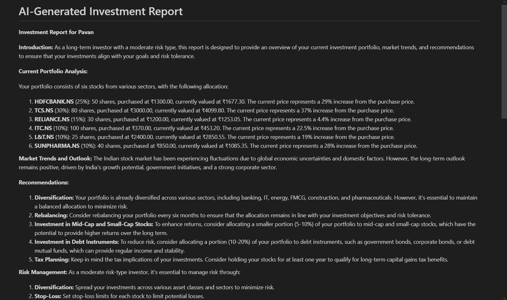
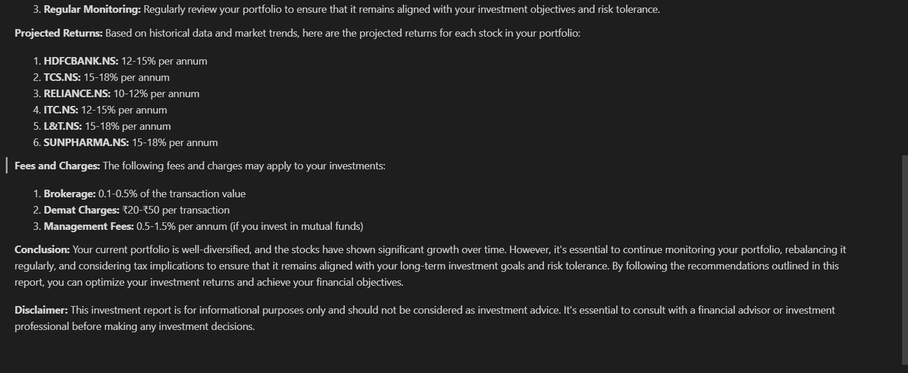

# Investment Report Generator (Approach 2 - Pydantic AI & Agents)

## 📌 Project Overview

This **Investment Report Generator** is an AI-driven system that dynamically generates **personalized investment reports** using **Pydantic AI Agents **. It follows **Approach **, where a **two-agent system** creates structured prompts and generates AI-driven investment reports tailored to an investor’s portfolio.

## 🚀 Features

- **Two-Agent AI System**
  - **Prompt Generator Agent** → Creates structured prompts based on user portfolio data.
  - **Investment Analyst Agent** → Uses prompts + real-time data to generate reports.
- **Dynamic Prompt & Report Generation** (Saved as Markdown files `prompt.md` & `report.md`)
- **Automated AI Report Structuring**
- **Logfire UI Integration** to manage LLM interactions

## 🔧 Installation & Setup

### 1️⃣ Clone the Repository

```bash
git clone https://github.com/your-repo/Investmentreport_generatorAI.git
cd Investmentreport_generatorAI
```

### 2️⃣ Create a Virtual Environment & Install Dependencies

```bash
python -m venv venv
source venv/bin/activate  # On Windows use: venv\Scripts\activate
pip install -r requirements.txt
```

### 3️⃣ Set Up API Keys

Create a `.env` file in the project directory and add your Google Gemini API key:

```ini
GOOGLE_API_KEY=your_gemini_api_key
GROQ_API_KEY = your_groq_api_key
```

### 4️⃣ Run the Script

```bash
python investmentreportgenerator.py
```

## 📥 User Input Format

When you run the script, it will prompt you to enter:

1. **Stock tickers** (`TCS.NS)
2. **Shares held for each stock**
3. **Purchase price per share**
4. **Portfolio allocation percentage**
5. **Investment goal** (Growth, Retirement, Income)
6. **Risk tolerance** (Conservative, Moderate, Aggressive)
7. **Investment horizon** (Short-term, 5 years, 10+ years)

## 📊 Example Portfolio Input



### **Generated System Prompt**



### **Generated Investment Report**




## 🛠️ Technologies Used

- **Python**
- **Pydantic AI Agents**
- **Groq for LLMs**

---

✅ **Now Run the Script and Generate Your Investment Report!** 🚀
